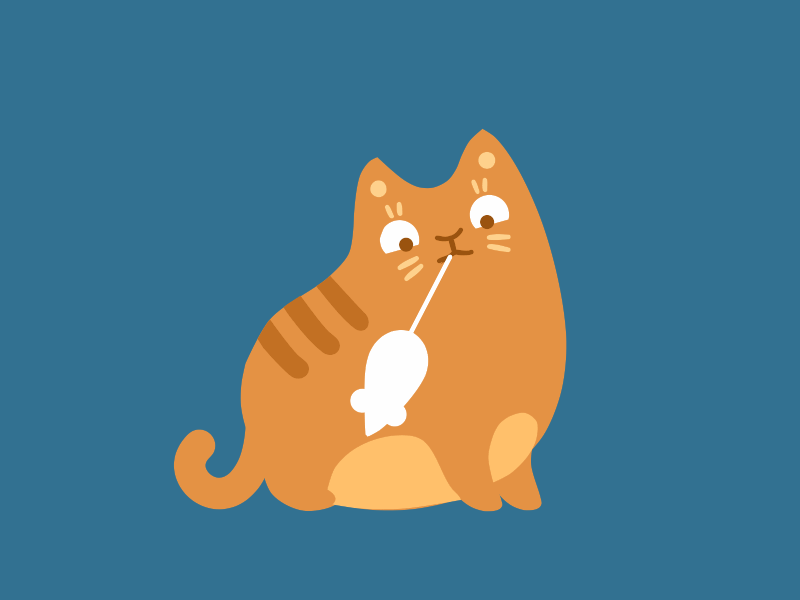

  

  <h3 align="center">Кейс от Нейротеха</h3>
  

    Все нужные ссылки:
     
    <a href="https://sdk.brainbit.com/">Документация по BrainBit</a>
    ·
    <a href="https://vk.com/open_cybergarden?from=quick_search">ВК-группа CyberGarden</a>
    ·
    <a href="https://brainbit.com/ru">Сайт BrainBit</a>
  

Кидайте все идеи, какие есть по хакатону.

## Планируемые фичи:
- Смена дизайна при смене настроения 
- Встроенный медиаплеер для прослушивания аудио из локального хранилища (лучше, чтобы была интеграция с онлайн-сервисом по возможности)
- Создание статистики настроения по времени в виде диаграммы 
- Дневник настроения 
- Плейлисты с треками(по настроению, усталости, время дня(утро, сон)) 
## Цветовая гамма: $${\color{blue}Синий \space \color{white}|\space \color{orange}Оранжевый}$$

## Вопросы:
1) В каком формате датасет?
2) Будет ли предоставляться устройство?
3) Какова аудитория проекта?
4) Какие данные необходимо выводить помимо настроения?
5) Необходим ли медиапроигрыватель, встроенный в приложение, и онлайн ли сервис для музыки?
6) Спросить про фичи
7) Какие эмоции должно распознавать приложение: стресс/расслабление, внимание/отвлечение, счастье/печаль?
8) Спросить про SDK

